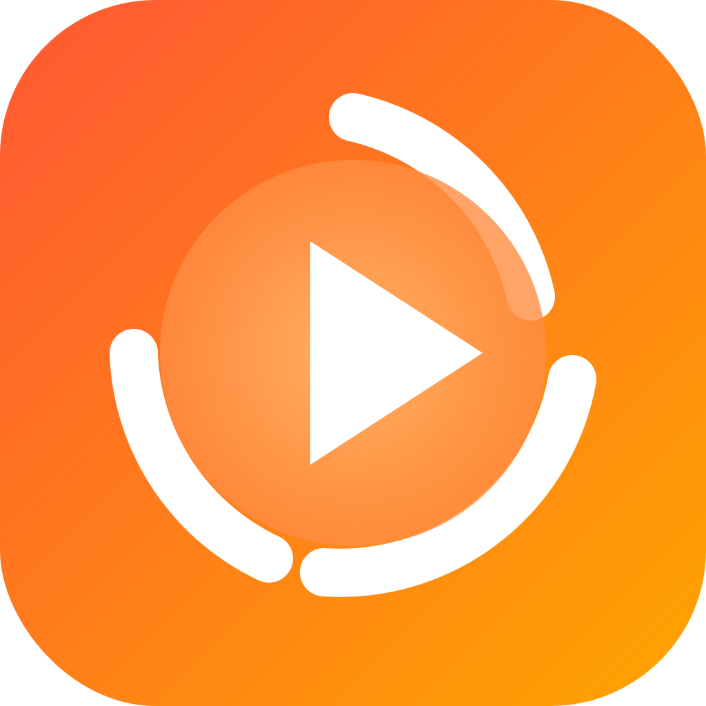

# MyTubeSync

  

  <strong>YouTube動画をお気に入り登録し、iCloudで同期できるiOSアプリ</strong>

  <a href="#english">English</a> | 日本語

---

## 概要

MyTubeSyncは、YouTubeの動画を検索・お気に入り登録し、複数のデバイス間でiCloudを通じて同期できるiOSアプリケーションです。視聴履歴の管理やチャンネル登録機能も備えており、お気に入りの動画を整理して楽しむことができます。

## 主な機能

### 動画機能
- YouTube動画の検索
- お気に入り動画の登録・管理
- カテゴリ別の動画整理
- 視聴履歴の自動記録
- アプリ内での動画再生

### チャンネル機能
- チャンネルの登録・管理
- 登録チャンネルの動画一覧表示

### 同期機能
- iCloudによるデバイス間データ同期
- SwiftDataによる高速なローカルストレージ

## 対応環境

- iOS 17.0以上
- iPhone対応

## 技術スタック

- **言語**: Swift
- **UI**: SwiftUI
- **データ管理**: SwiftData + CloudKit
- **動画再生**: YouTubePlayerKit
- **API**: YouTube Data API v3

## ダウンロード

## 法的情報

- [プライバシーポリシー](https://tokomac.github.io/MyTubeSync/privacy-policy.html)
- [利用規約](https://tokomac.github.io/MyTubeSync/terms-of-service.html)

## 開発

このアプリはオープンソースではありませんが、フィードバックや機能リクエストを歓迎しています。

## お問い合わせ

ご質問やフィードバックは以下までお願いします：
- Email: tokomatokomac@gmail.com
- [お問い合わせページ](https://tokomac.github.io/MyTubeSync/contact.html)

---

# MyTubeSync (English)

  <strong>An iOS app for saving favorite YouTube videos with iCloud sync</strong>

  English | <a href="#mytubesync">日本語</a>

---

## Overview

MyTubeSync is an iOS application that allows you to search and save your favorite YouTube videos, syncing them across multiple devices via iCloud. It also includes watch history management and channel subscription features, making it easy to organize and enjoy your favorite videos.

## Key Features

### Video Features
- Search YouTube videos
- Save and manage favorite videos
- Organize videos by categories
- Automatic watch history recording
- In-app video playback

### Channel Features
- Subscribe to and manage channels
- View video lists from subscribed channels

### Sync Features
- Cross-device data sync via iCloud
- Fast local storage with SwiftData

## Requirements

- iOS 17.0 or later
- iPhone compatible

## Technology Stack

- **Language**: Swift
- **UI**: SwiftUI
- **Data Management**: SwiftData + CloudKit
- **Video Player**: YouTubePlayerKit
- **API**: YouTube Data API v3

## Download

## Legal Information

- [Privacy Policy](https://tokomac.github.io/MyTubeSync/privacy-policy-en.html)
- [Terms of Service](https://tokomac.github.io/MyTubeSync/terms-of-service-en.html)

## Development

This app is not open source, but feedback and feature requests are welcome.

## Contact

For questions or feedback:
- Email: tokomatokomac@gmail.com
- [Contact Page](https://tokomac.github.io/MyTubeSync/contact-en.html)

---

© 2025 MyTubeSync
